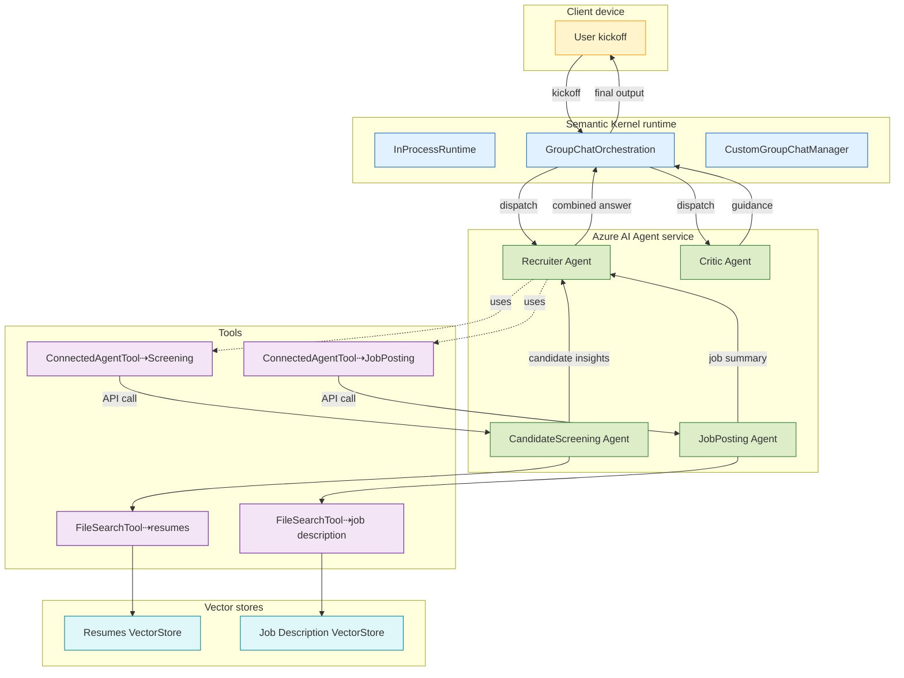

# Connected Agents - AI-Powered Recruitment System

A multi-agent system that automates the recruitment process by analyzing job descriptions and candidate resumes using Azure AI Agent services and Semantic Kernel.

## Overview

This application demonstrates a connected agents architecture where multiple AI agents collaborate to:
- Analyze job postings and requirements
- Screen candidate resumes against job criteria
- Provide ranked recommendations with scoring
- Guide the recruitment workflow through intelligent orchestration

## Architecture



## Sample Output

```
╭──────────────────────────────────────╮
│ Found 4 existing agents to delete... │
╰──────────────────────────────────────╯
Deleted agent asst_XXXXXXXXXXXXXXXXXXXX
Deleted agent asst_XXXXXXXXXXXXXXXXXXXX
Deleted agent asst_XXXXXXXXXXXXXXXXXXXX
Deleted agent asst_XXXXXXXXXXXXXXXXXXXX
╭──────────────────────────────────╮
│ Uploading job description PDF... │
╰──────────────────────────────────╯
╭──────────────────────╮
│ Uploading resumes... │
╰──────────────────────╯
Resumes uploaded successfully.
╭──────────────────────────────────────╮
│ Creating vector store for resumes... │
╰──────────────────────────────────────╯
Created vector store (ID: vs_XXXXXXXXXXXXXXXXXXXX)
╭──────────────────────────────────────────────╮
│ Creating vector store for job description... │
╰──────────────────────────────────────────────╯
Created vector store (ID: vs_XXXXXXXXXXXXXXXXXXXX)
╭─────────────────────────────╮
│                             │
│ --- Starting Group Chat --- │
│                             │
╰─────────────────────────────╯
╭────────────────────────────── recruiter ───────────────────────────────╮
│ The job posting is for a Senior Cloud Solutions Engineer at Contoso    │
│ Corporation in Bellevue, WA. Responsibilities include designing and    │
│ implementing enterprise-grade cloud solutions, leading technical       │
│ architecture decisions, and driving innovation in cloud service        │
│ offerings. The position requires at least 5 years of experience in     │
│ cloud architecture, expertise in distributed systems and               │
│ microservices, and proficiency with major cloud platforms such as      │
│ Azure, AWS, or GCP. Additional qualifications include experience with  │
│ agile methodologies, strong communication skills, and a background in  │
│ enterprise software development. Contoso highlights its commitment to  │
│ diversity and equal opportunity employment .                           │
╰────────────────────────────────────────────────────────────────────────╯
╭─────────────────────────────── workflow ───────────────────────────────╮
│ Please provide a list of 5 candidates that best match the job          │
│ description. Format as table, include columns with scoring and         │
│ ranking.                                                               │
╰────────────────────────────────────────────────────────────────────────╯
╭────────────────────────────── recruiter ───────────────────────────────╮
│ Here are 5 candidates that best match the Senior Cloud Solutions       │
│ Engineer position at Contoso Corporation, ranked by their screening    │
│ scores:                                                                │
│                                                                        │
│ | Candidate Name    | Scoring (out of 10) | Ranking |                  │
│ |-------------------|---------------------|---------|                  │
│ | Maria Gonzalez    | 10                  | 1       |                  │
│ | Aisha Patel       | 9                   | 2       |                  │
│ | Emma Thompson     | 9                   | 3       |                  │
│ | Thomas Chen       | 8                   | 4       |                  │
│ | Alexander Kumar   | 8                   | 5       |                  │
│                                                                        │
│ This ranking is based on criteria such as relevant experience, cloud   │
│ expertise with Azure/AWS/GCP, technical leadership, and certifications │
│ .                                                                      │
╰────────────────────────────────────────────────────────────────────────╯
╭─────────────────────────────── workflow ───────────────────────────────╮
│ Please rank the candidates based on their suitability for the job      │
│ posting.                                                               │
╰────────────────────────────────────────────────────────────────────────╯
╭────────────────────────────── recruiter ───────────────────────────────╮
│ Here are the top 5 candidates ranked by their suitability for the      │
│ Senior Cloud Solutions Engineer role at Contoso Corporation, with      │
│ scores and brief justifications:                                       │
│                                                                        │
│ | Candidate Name      | Score (out of 10) | Justification |            │
│ |---------------------|-------------------|--------------------------- │
│ ---------------------------------------------------------------------- │
│ -----------------------------------------|                             │
│ | Maria Gonzalez      | 10                | Deep cloud expertise and   │
│ leadership; Principal Engineer at Contoso. Extensive experience in     │
│ cloud-native apps, distributed systems, and holds top-tier             │
│ certifications . |                                                     │
│ | Aisha Patel         | 9                 | Senior Engineer at Contoso │
│ with strong cloud/DevOps expertise, led microservices initiatives, and │
│ has multiple relevant cloud certifications . |                         │
│ | Emma Thompson       | 9                 | Senior Engineer at Contoso │
│ with strong cloud architecture background; experience in               │
│ microservices, agile, and CISSP certified . |                          │
│ | Thomas Chen         | 8                 | Senior Engineer at         │
│ Contoso, broad scalable cloud architecture/DevOps experience on Azure, │
│ GCP; led process improvements and dev team initiatives . |             │
│ | Alexander Kumar     | 8                 | Senior Engineer at Contoso │
│ with strong microservices, Kubernetes, DevOps, and leadership          │
│ background; holds Kubernetes and Scrum Master certs . |                │
│                                                                        │
│ Let me know if you need further breakdowns or next steps!              │
╰────────────────────────────────────────────────────────────────────────╯
╭─ workflow ─╮
│ COMPLETED  │
╰────────────╯
╭──────────────────────────────╮
│ --- Group Chat Completed --- │
│ COMPLETED                    │
╰──────────────────────────────╯
```